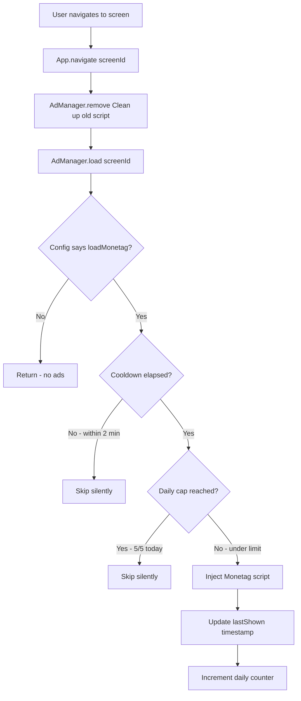

# Ad Control Implementation Plan — Smart Attendance PWA

## Overview

Currently, the app loads Monetag MultiTag ads on specific screens (`login` and `faculty-dash`) and removes them on `attendance-mode`. There is no frequency capping or cooldown mechanism, meaning ads can fire on every screen navigation. This plan adds granular placement control and multiple layers of frequency management.

---

## Current Architecture (Before)

```
navigate(screenId)
├── screen === 'faculty-dash' → loadDashboardAds()  // inject Monetag script
├── screen === 'login'        → loadDashboardAds()  // inject Monetag script
└── screen === 'attendance-mode' → removeDashboardAds()

Direct-link ads (omg10.com):
├── handleReturnToDashboard()  // always fires
├── generateWhatsAppMessage()  // always fires
├── shareDateReport()          // always fires
└── downloadReport()           // always fires
```

## Target Architecture (After)

```
AdManager Module (centralized singleton)
├── AdManager.load(screenId)
│   ├── check cooldown timer
│   ├── check daily impression cap
│   ├── if allowed → inject Monetag script
│   └── if denied  → skip silently
├── AdManager.remove()
│   └── remove Monetag script + orphan iframes
├── AdManager.fireDirectLink(url)
│   ├── check cooldown + daily cap
│   └── if allowed → window.open(url)
└── AdManager.getState()
    └── return { lastShown, todayImpressions, cooldownMs }

Navigation calls:
navigate(screenId)
├── AdManager.remove() on every navigation
├── AdManager.load(screenId) based on placement config
└── screen-specific ad rules

Direct-link calls in code:
└── AdManager.fireDirectLink(url) instead of raw window.open()
```

---

## Implementation Steps

### Step 1: Create `js/ad-manager.js` — Centralized Ad Module

A new module that wraps all ad logic into a single, testable unit.

**Key design decisions:**

1. **Placement Configuration** — A declarative config object mapping screen IDs to ad behavior:
   - `loadMonetag: boolean` — whether to inject the MultiTag script
   - `allowDirectLinks: boolean` — whether direct-link ads fire on this screen
   - `label: string` — human-readable name for logging

2. **Cooldown Timer** — Per-session timer in milliseconds. Configurable default (e.g., 120000 = 2 min). Prevents Monetag reload if the user navigates back quickly.

3. **Daily Impression Cap** — Stored in `localStorage` with a date key. Configurable default (e.g., 5 impressions/day). Resets at midnight.

4. **Direct-Link Queue** — Instead of firing immediately, queue direct-link opens and batch them to avoid ad-blocker triggers.

### Step 2: Define Placement Config

```js
const PLACEMENT_CONFIG = {
  'login':            { loadMonetag: true,  allowDirectLinks: false, label: 'Login Screen' },
  'faculty-dash':     { loadMonetag: true,  allowDirectLinks: true,  label: 'Faculty Dashboard' },
  'attendance-mode':  { loadMonetag: false, allowDirectLinks: false, label: 'Attendance Entry' },
  'reports':          { loadMonetag: false, allowDirectLinks: true,  label: 'Reports Screen' },
  'install-guide':    { loadMonetag: false, allowDirectLinks: false, label: 'Install Guide' },
};
```

### Step 3: Frequency Control Logic

| Layer | Scope | Mechanism | Default |
|-------|-------|-----------|---------|
| Screen cooldown | Per session | `sessionStorage` timestamp + timer check | 2 min between Monetag loads |
| Daily impression cap | Per device | `localStorage` count + date key | 5 popunders/day |
| Monetag dashboard | Per user (external) | Monetag panel settings | Set after deployment |

### Step 4: Direct-Link Ad Consolidation

Replace all 4 raw `window.open()` calls with `AdManager.fireDirectLink(url)`. The method will:
1. Check daily cap
2. Check cooldown
3. Either fire the popunder or silently skip

### Step 5: Remove Old Functions

Delete `loadDashboardAds()` and `removeDashboardAds()` from `js/app.js` — their responsibilities move to `AdManager`.

---

## Detailed Code Architecture

### `js/ad-manager.js` — Full Module Layout

```
┌─────────────────────────────────────────────────────┐
│  const AdManager = (() => {                         │
│    // ─── CONSTANTS ──────────────────────────────  │
│    const DEFAULT_COOLDOWN_MS = 120000;   // 2 min   │
│    const DEFAULT_DAILY_CAP = 5;                     │
│    const STORAGE_KEY = 'sa_ad_state';               │
│    const MONETAG_ZONE = '260367';                   │
│    const MONETAG_SRC = 'https://quge5.com/88/tag.min.js';│
│                                                      │
│    // ─── STATE ─────────────────────────────────  │
│    const _state = {                                  │
│      lastMonetagShown: 0,      // timestamp         │
│      monetagLoaded: false,     // is script in DOM  │
│      currentScreen: '',                              │
│      config: PLACEMENT_CONFIG,                       │
│      cooldownMs: DEFAULT_COOLDOWN_MS,                │
│      dailyCap: DEFAULT_DAILY_CAP,                    │
│    };                                                │
│                                                      │
│    // ─── PRIVATE METHODS ────────────────────────  │
│    function _getDailyImpressions()                   │
│    function _incrementDailyImpressions()             │
│    function _isUnderDailyCap()                       │
│    function _isCooldownElapsed()                     │
│    function _injectMonetagScript()                   │
│    function _removeMonetagScript()                   │
│    function _firePopunder(url)                       │
│                                                      │
│    // ─── PUBLIC API ────────────────────────────   │
│    return {                                          │
│      load(screenId),        // called on navigate   │
│      remove(),              // called on navigate   │
│      fireDirectLink(url),   // wraps window.open    │
│      getState(),            // for debugging        │
│      setConfig(config),     // override defaults    │
│    };                                                │
│  })();                                               │
└─────────────────────────────────────────────────────┘
```

### Key Method Implementations

#### `load(screenId)`
```
1. Remove any existing Monetag script (clean slate)
2. Look up screenId in PLACEMENT_CONFIG
3. If config.loadMonetag === false → return (no ads for this screen)
4. Check _isCooldownElapsed() → if not elapsed, return silently
5. Check _isUnderDailyCap() → if cap reached, return silently
6. Call _injectMonetagScript()
7. Update _state.lastMonetagShown = Date.now()
8. Increment daily counter
```

#### `fireDirectLink(url)`
```
1. Check _isCooldownElapsed() → if not elapsed, return
2. Check _isUnderDailyCap() → if cap reached, return
3. _firePopunder(url) — the actual window.open
4. Increment daily counter
```

#### `_getDailyImpressions()` / `_incrementDailyImpressions()`
```
Storage schema in localStorage:
  key: 'sa_ad_state'
  value: { date: '2026-07-18', count: 3 }

On read: if stored.date !== today → reset count to 0
On increment: update count, write back
```

---

## Files to Modify

| File | Action | Details |
|------|--------|---------|
| `js/ad-manager.js` | **CREATE** | New centralized ad control module |
| `js/app.js` | **MODIFY** | Replace `loadDashboardAds()`/`removeDashboardAds()` with `AdManager.load()`/`AdManager.remove()` calls; replace 4 raw `window.open()` with `AdManager.fireDirectLink()` |
| `app.html` | **MODIFY** | Add `<script src="js/ad-manager.js"></script>` before `js/app.js` |

---

## Monetag Dashboard Configuration (External)

After deployment, log in to Monetag → MultiTag settings:

1. **Frequency Capping**
   - Set **"Show popunder to same user every"** → `30 minutes` (minimum interval)
   - Set **"Max popunders per user per day"** → `5`

2. **Site Settings**
   - Ensure your domain is whitelisted
   - Enable **"Smart Ad Loading"** if available

3. **MultiTag Settings**
   - Keep **"Fallback"** ad types enabled (push notifications, banner) for better fill rate
   - Enable **"Lazy Load"** if available

> **Note:** The Monetag dashboard controls are independent of your code. They act as a second layer of frequency protection. Your app's cooldown (2 min) is tighter than Monetag's external setting (30 min) for safety.

---

## Mermaid Diagram: Ad Loading Flow



---

## Edge Cases & Considerations

| Case | Handling |
|------|----------|
| User navigates rapidly between screens | Cooldown prevents ad reload within 2 min |
| User uses app offline | `_injectMonetagScript()` will create a script tag that fails to load — this is safe, script.onerror does nothing |
| localStorage is cleared | Daily cap resets — acceptable, user gets fresh allocation |
| Ad-blocker blocks Monetag | Script load fails silently, no impact on app functionality |
| Midnight rollover | `_getDailyImpressions()` compares stored date vs current date; resets automatically |
| Multiple tabs open | Each tab maintains its own cooldown (sessionStorage) but shares daily cap (localStorage) — slight race condition, acceptable |

---

## Testing Checklist

- [ ] Navigate to `login` → Monetag script injected (verify in DevTools Network tab)
- [ ] Navigate to `faculty-dash` → Monetag still loaded
- [ ] Navigate to `attendance-mode` → Monetag script removed
- [ ] Navigate back to `faculty-dash` within 2 min → script NOT injected (cooldown)
- [ ] Wait 2 min, navigate to `faculty-dash` → script injected again
- [ ] Trigger 5 direct-link actions → 6th is blocked (daily cap)
- [ ] Change device date to next day → cap resets
- [ ] Direct-link ads respect cooldown (test with rapid WhatsApp shares)
- [ ] No console errors when Monetag script fails to load (offline/ad-blocker)
