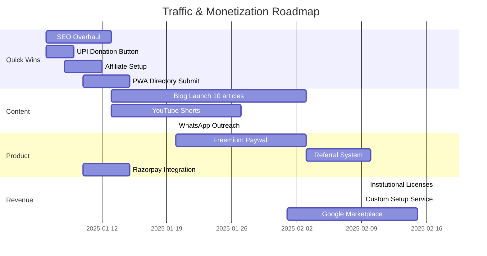

# Smart Attendance PWA — Traffic Growth & Monetization Plan

## Current Status

| Metric | Value |
|--------|-------|
| App type | Free PWA — Digital Classroom Attendance |
| Platform | Cloudflare Pages + Google Sheets (GAS backend) |
| Current traffic | **30-50 impressions/day** (~900-1,500/month) |
| Current monetization | Monetag (Zone 260367) — ads on login screen only |
| Target audience | Teachers in Indian colleges/schools |
| Author | Independent developer (India, +91) |
| Language | English (India market) |

---

## Part 1: Traffic Growth Strategies (0→1,000 impressions/day)

### Phase 1 — Quick Wins (Week 1-2)

#### 1.1 SEO Overhaul
The app is a free tool. SEO is the highest-ROI channel long-term.

| Task | Detail | Priority |
|------|--------|----------|
| Add FAQ schema to index.html | Structured data for "free attendance app" queries | High |
| Add breadcrumb schema | Navigation context for search engines | High |
| Create /blog/ page | Basic blog section with SEO-optimized articles | High |
| Target keywords | "free attendance app for teachers", "digital attendance system", "Google Sheets attendance", "student attendance tracker India" | High |
| Add hreflang tags | If expanding to regional Indian languages | Medium |
| Generate XML sitemap | Already has sitemap.xml — verify completeness | Low |

#### 1.2 Google Workspace Marketplace Listing
Since the app uses Google Sheets as backend, listing on Google Workspace Marketplace gives:
- Instant credibility
- Built-in search traffic from teachers looking for Sheets add-ons
- Free listing

**Action:** Package the app as a Google Workspace Add-on that links to the PWA.

#### 1.3 PWA Directories Submission
Submit to these directories (most are free):
- PWADirectory.com
- PWAStats.com
- AppScope (Lighthouse)
- Cloudflare Pages showcase
- AlternativeTo.net (under "Attendance tracking")

---

### Phase 2 — Content Marketing (Week 2-6)

#### 2.1 Blog Content Strategy
Create 10 evergreen articles targeting long-tail keywords:

| # | Topic | Target Keyword |
|---|-------|---------------|
| 1 | "How to take attendance using Google Sheets for free" | `google sheets attendance` |
| 2 | "Best free attendance app for college teachers in India" | `free attendance app india` |
| 3 | "How to automate attendance tracking with PWA" | `automated attendance tracking` |
| 4 | "Paperless classroom: Digital attendance guide for teachers" | `paperless classroom attendance` |
| 5 | "Attendance management system without spending money" | `free attendance management system` |
| 6 | "How to track student attendance on mobile" | `student attendance tracker mobile` |
| 7 | "Offline attendance app for teachers" | `offline attendance app teachers` |
| 8 | "Replace physical register with digital attendance" | `digital attendance register` |
| 9 | "Attendance report generation for colleges" | `attendance report generator` |
| 10 | "Google Sheets sync attendance app review" | `google sheets attendance sync` |

#### 2.2 YouTube Shorts / Videos
Teachers search YouTube for tech tutorials. Create:
- 60-second demo: "How to take attendance in 30 seconds"
- Installation guide: "Install this free attendance app on your phone"
- Comparison: "Best free attendance apps for teachers 2025"

#### 2.3 WhatsApp Broadcast Marketing
**India-specific — extremely effective.**

- Join teacher WhatsApp groups (5-10 groups of 200+ members)
- Share a useful tip + link to the app (not spam — genuinely useful content)
- Create a shareable image with QR code linking to the app

---

### Phase 3 — Outreach & Partnerships (Week 4-12)

#### 3.1 Direct Institution Outreach

| Channel | Method | Expected Impact |
|---------|--------|----------------|
| LinkedIn | Connect with HODs, principals — share demo video | High |
| Email | Cold email with value proposition + QR code | Medium |
| College tech fests | Attend/virtual booth — offer free workshop | High |
| Educational conferences | Network with decision-makers | Medium |

#### 3.2 Referral Mechanics
Add a referral system in-app:
- "Share with a fellow teacher" button
- Simple UPI-based incentive (₹10 per referral) or feature unlock

#### 3.3 College Ambassador Program
- Recruit 1 student per college to promote to their teachers
- Offer certificate + reference letter
- Cost: ₹0 upfront

---

## Part 2: Alternative Monetization for Low Traffic

### The Core Problem

At 30-50 impressions/day:
- **Monetag** → $0.0015-$0.15/day (CPM $0.50-$3.00) → pays out $5 **never at this rate**
- **Any CPM ad network** → Same problem — traffic too low for ad revenue

### Recommended Approach: Hybrid Model

| Method | Revenue Potential | Effort | Traffic Needed | Payout Threshold |
|--------|-------------------|--------|----------------|-----------------|
| ~~Ad networks~~ | Negligible | Low | 1,000+/day | $5-$100 |
| **Donations/UPI** | ₹0-2,000/month | Low | Any | None |
| **Freemium unlocks** | ₹500-5,000/month | Medium | Any | None |
| **Institutional licenses** | ₹5,000-50,000/year | High | Any | None |
| **Affiliate (edu products)** | ₹0-3,000/month | Low | Any | ₹500 min |
| **Sponsorship** | ₹5,000-20,000/quarter | Medium | Any | None |

### Recommended Stack (Order of Implementation)

#### Tier 1 — Immediate Setup (Week 1, Zero Traffic Required)

**1. UPI / Razorpay Donation Button**
- Add a "Support this app" button on the dashboard
- Razorpay integration (Indian payment gateway, easy setup)
- No minimum payout threshold — money goes directly to your bank
- Framing: "Help keep this app free for all teachers"
- Expected: ₹100-500/month from 30-50 daily users

**2. "Buy Me a Coffee" / Ko-fi Link**
- Zero integration effort
- Add link in app footer + install guide page
- Expected: ₹200-500/month

#### Tier 2 — Low Effort (Week 2-4)

**3. Affiliate Marketing (Educational Products)**
- Amazon India affiliate program (free, 3-5% commission)
- Promote: Printers, projectors, whiteboards, stationery
- Place relevant affiliate banners on the reports/download pages
- Payout: Amazon Gift Card (₹0 threshold) or bank transfer (₹1,000)

**4. Premium Feature Toggle (Freemium)**
Add a configuration flag in [`js/app.js`](js/app.js) for premium features:

| Feature | Free | Premium (₹199 lifetime) |
|---------|------|------------------------|
| Basic attendance | ✅ | ✅ |
| Basic reports | ✅ | ✅ |
| Excel download | ✅ | ✅ |
| **Advanced reports** (charts, trends) | ❌ | ✅ |
| **Batch management** (multiple batches) | ❌ | ✅ |
| **Data backup to email** | ❌ | ✅ |
| **Custom branding** (college name on reports) | ❌ | ✅ |
| **Priority support (WhatsApp)** | ❌ | ✅ |

- Price point: ₹199 one-time (teachers pay easily via UPI)
- Integrate Razorpay payment links
- Expected conversion rate: 3-5% of active users

#### Tier 3 — High Value (Month 2-6)

**5. Institutional Licensing**
- Sell licenses to colleges/schools (not individual teachers)
- Pricing: ₹5,000-₹25,000/year per institution
- Features: Admin dashboard, multiple teacher accounts, custom branding, dedicated support
- Sales channel: LinkedIn outreach + email + WhatsApp
- 1 sale = equivalent to 500,000 ad impressions

**6. Paid Custom Integration / Setup Service**
- Many colleges want attendance systems but can't set up Google Sheets
- Offer: "I'll set up Smart Attendance for your college — ₹2,000"
- Includes: Google Sheet setup, teacher onboarding, training session

---

## Implementation Roadmap

---

## Expected Outcomes

| Timeframe | Traffic | Monetization |
|-----------|---------|--------------|
| Month 1 | 50-200 impressions/day | ₹500-1,500/month (donations + affiliate) |
| Month 2 | 200-500 impressions/day | ₹1,500-3,000/month (add freemium) |
| Month 3 | 500-1,000 impressions/day | ₹3,000-8,000/month |
| Month 6 | 1,000-3,000 impressions/day | ₹8,000-25,000/month (add institutional licenses) |

**Key Insight:** At your current traffic level, **don't rely on ad networks**. Focus on direct monetization (donations, freemium, licenses) where there's no $5 payout threshold. Use traffic growth to build user base, then monetize through premium features and institutional sales.

---

## Files to Modify

| File | Change | Purpose |
|------|--------|---------|
| [`app.html`](app.html) | Add donation/freemium UI elements | Monetization |
| [`js/app.js`](js/app.js) | Premium feature gating logic | Freemium paywall |
| [`js/ad-manager.js`](js/ad-manager.js) | Keep Monetag for now (no harm) | Passive ad revenue |
| [`index.html`](index.html) | Add FAQ schema, blog link, affiliate banners | SEO + affiliate |
| [`sw.js`](sw.js) | No changes needed | — |
| [`manifest.json`](manifest.json) | Add screenshots for Play Store/App Store listing | Trust signal |
